# Cognitive Memory Consolidation Engine v5

> Research-grade, biologically-grounded long-term memory for conversational AI.
> Every mechanism maps to a peer-reviewed paper. Every parameter has a reason.
>
> v5 closes the loop: sleep consolidation now writes `consolidation_strength` to
> SQLite, retrieval reads it, and encoding arousal is captured before the LLM
> ever touches the raw message. What the brain learns during sleep is what gets
> recalled first the next morning.

---

## Table of Contents

1. [Architecture](#1-architecture)
2. [Memory Entry Structure](#2-memory-entry-structure)
3. [Memory Tiers](#3-memory-tiers)
4. [Encoding Fidelity — Arousal & Protection](#4-encoding-fidelity--arousal--protection)
5. [Scoring Pipeline](#5-scoring-pipeline)
6. [Cluster Building & Sleep-Phase Weighting](#6-cluster-building--sleep-phase-weighting)
7. [Recall Integration](#7-recall-integration)
8. [Hard Deletion & Protection Guards](#8-hard-deletion--protection-guards)
9. [SleepBudget — Parameters](#9-sleepbudget--parameters)
10. [SleepReport — Observability](#10-sleepreport--observability)
11. [Phenomena Test Suite](#11-phenomena-test-suite)
12. [Time-Range Test Suite](#12-time-range-test-suite)
13. [References](#13-references)

---

## 1. Architecture

```
run_consolidation()
├─ PHASE 0   SCAN    — Load ≤300 candidates. Build vector neighbor map (top-20).
├─ PHASE 0b  SCORE   — BLA + spreading + arousal + surprise + TG + PI → strength [0,1]
│                      → batch_update_consolidation_strength() persists to SQLite
├─ PHASE 1   REPLAY  — BFS connected-components clustering (order-independent).
│                      Episodic vs schema label. REM-weighted priority.
│                      LLM summarise → long mem. Depth cap (depth≥3 → conf≥0.70 required).
│                      Provisional summaries: source memories protected for 14d.
│                      Every hard-delete written to forgotten_log audit table.
├─ PHASE 2   TIERS   — Promote/demote based on strength + dup_count gate.
├─ PHASE 3   PRUNE   — Dead traces, redundant copies (≥1 rep always kept), interference.
└─ PHASE 4   CYCLES  — Increment consolidation_cycles for all scanned candidates.
```

**Key v5 change:** Phase 0b now writes computed strength to SQLite. Retrieval reads it.
The sleep→recall feedback loop is closed.

---

## 2. Memory Entry Structure

| Field                    | Type          | Description                                                             |
| ------------------------ | ------------- | ----------------------------------------------------------------------- |
| `id`                     | `str`         | UUID                                                                    |
| `text`                   | `str`         | Raw text                                                                |
| `embedding`              | `np.ndarray`  | Float32 vector                                                          |
| `importance`             | `float [0,1]` | Static importance at encoding                                           |
| `memory_type`            | `str`         | `flash` / `short` / `long`                                              |
| `access_count`           | `int`         | Total retrievals                                                        |
| `created_at`             | `float`       | Unix timestamp                                                          |
| `last_accessed`          | `float\|None` | Last retrieval                                                          |
| `source_turn`            | `int\|None`   | Conversation turn at encoding                                           |
| `consolidated_into_id`   | `str\|None`   | Summary this was merged into                                            |
| `deleted`                | `int`         | 0 = live, 1 = soft-deleted                                              |
| **`consolidation_strength`** | `float [0,1]` | **v5** — Score written by sleep engine; read at recall time. Bumped +0.05 on every `touch()`. |
| `metadata`               | `dict`        | `consolidation_cycles`, `is_summary`, `is_provisional`, `encoding_arousal`, `protection_tier`, `consolidation_depth`, `cluster_type` |

**`consolidation_strength` lifecycle:**

```
encoding:   0.0   (never touched by sleep yet)
sleep 0b:   scored by BLA/arousal/spreading/PI/TG → written to SQLite
each touch: +0.05, capped at 1.0
recall:     W_STRENGTH=0.25 weight in composite score
```

---

## 3. Memory Tiers

```
FLASH ──(M≥0.62 OR I_dyn≥0.70, age>3h)──▶ SHORT ──(M≥0.72 AND cycles≥2)──▶ LONG
  ◀──(M≤0.28 AND days>14)──────────────             ◀──(M≤0.25 AND days>60 AND I_dyn≤0.45)──

                                              SHORT→LONG routing:
                                              dup_count == 0  →  direct promotion
                                              dup_count >= 2  →  cluster-summary route
```

Flash promotion requires age > **3h** (raised from 1h). Long demotion blocked if `I_dyn > 0.70`.

**v5 changes vs v4.1:**
- `flash_to_short_strength`: 0.55 → **0.62** (reduces noise in short tier)
- `min_flash_age_sec`: 3600 → **10800** (1h → 3h gate)
- `short_to_long_max_sim ≤ 0.60` gate **removed** — replaced with `dup_count` routing (the old gate blocked promotion for memories that shared common vocabulary but were otherwise unique)

---

## 4. Encoding Fidelity — Arousal & Protection

### 4.1 Encoding Arousal (P1)

Before the Brain LLM compresses the user's message, the pipeline extracts a raw arousal signal from the original text:

```python
encoding_arousal = _compute_encoding_arousal(raw_user_message)
# keyword + bigram density: 3+ hits → 1.0
# stored in metadata["encoding_arousal"]
```

Keywords span urgency (`urgent`, `emergency`, `critical`), emotion (`love`, `hate`, `fear`, `cry`), medical/legal/financial terms, and high-stakes bigrams (`never forget`, `this is important`). 24 Hindi/Hinglish high-arousal terms are included (`zaruri`, `bahut important`, `dil se`, `kabhi mat bhulna`, etc.).

**Why capture it before Brain?** The LLM's ingestion summarises and compresses. Emotional nuance that doesn't survive compression is still real — it should influence how long the memory lasts. Capturing arousal from the raw text preserves this signal even when the summary is neutral.

`encoding_arousal` is used in:
- Sleep Phase 0b scoring (amplifies `consolidation_strength`)
- Retrieval composite score (`W_AROUSAL = 0.10`)
- Novelty-burst micro-consolidation (see §7.3)

### 4.2 Protection Tiers (P3)

The Brain's ingestion schema includes a `protection_tier` field:

| Tier       | Condition                                               | Effect                                    |
| ---------- | ------------------------------------------------------- | ----------------------------------------- |
| `normal`   | Default                                                 | Standard lifecycle rules                  |
| `critical` | Medical, legal, financial fact explicitly emphasised    | Protected until consolidated              |
| `immortal` | User said "never forget this" or equivalent             | Protected permanently, even post-summary  |

Protection is enforced in `_is_protected()`:

```
Rule A: importance ≥ 0.80 AND consolidated_into_id is None
Rule B: importance ≥ 0.70 AND dup_count == 0              ← broadened in v5
Rule C: metadata.protection_tier in ("critical","immortal")
```

Any one rule makes the memory exempt from all hard-delete paths.

---

## 5. Scoring Pipeline

### 5.1 Petrov BLA [P1]

```
B_i ≈ ln( Σ_{j=1}^{3} t_j^(-d_eff) + (n-3)×integral_approx )

d_eff = d × (1 − α × I)    d=0.5, α=0.40
bla_norm = sigmoid(B_i)

Access times reconstructed by linear interpolation between created_at and last_accessed.
```

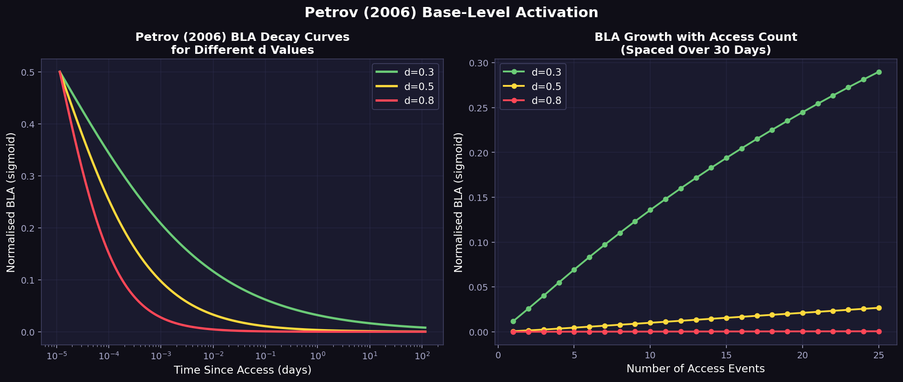

### 5.2 Dynamic Importance [P7]

```
I_dyn = I_0×exp(−λ×t_age) + w_acc×min(1,(acc/t_age)×30) + w_ar×arousal(m)
λ=0.003/day,  w_acc=0.35,  w_ar=0.15

source_turn ≤ 3  →  λ_eff = λ×1.3   (primacy penalty)
```

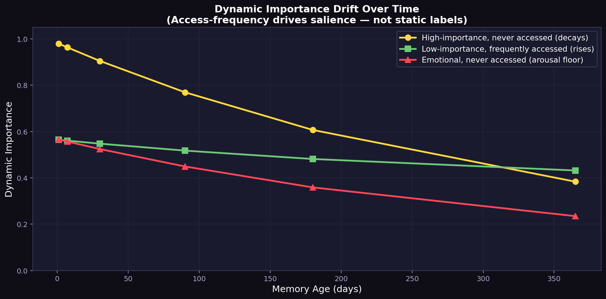

### 5.3 Spreading Activation / Fan Effect [P2]

```
S_ji = S − ln(fan_j)    S=1.5
A_spread = Σ (W/N)×S_ji×sigmoid(B_j)    clamped [−0.20, +0.30]
Crossover at fan ≈ exp(1.5) ≈ 4.5
```

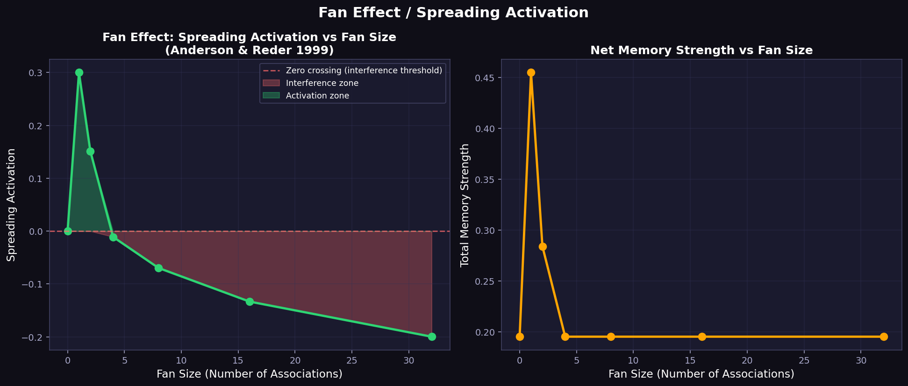

### 5.4 Emotional Arousal Amplifier [P5]

```
arousal = min(1, 0.50×I + 0.30×min(1,keywords/3) + 0.12×min(1,CAPS/3) + 0.08×min(1,punct/3))
amplified = combined × (1 + 0.50×arousal)
```

68 ANEW-validated English keywords spanning trauma, loss, urgency, and high-stakes life events. **v5 adds 24 Hindi/Hinglish keywords** (`zaruri`, `bahut important`, `dil se`, `kabhi mat bhulna`, `darr`, `gussa`, `khush`, `takleef`, `maut`, `pyaar`, `nafrat`, `zindagi`, etc.).

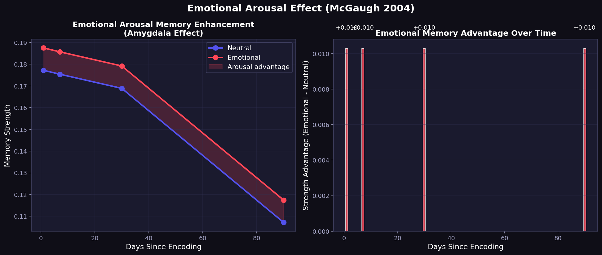

### 5.5 Prediction Error / Surprise [P6]

```
Fires when: sim_max ≥ 0.55  AND  text matches contradiction pattern
amplified += 0.15
```

Patterns: `not | no longer | cancelled | fired | quit | actually | correction | wrong | changed | failed | never | deprecated | replaced | corrected` (+ others)

### 5.6 Temporal Gradient — 24h Bump [P9]

```
TG = 0.04 × exp(−(t_age − 86400)² / (2×21600²))
amplified += TG    [additive; <0.001 by 7 days]
```

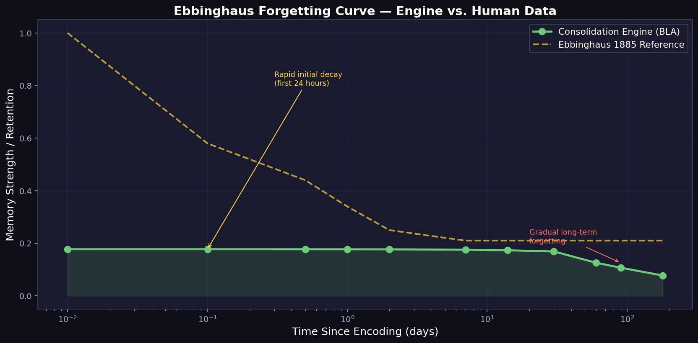

### 5.7 Proactive Interference [P11]

```
PI = −Σ min(0.15, sim×r×Δt_j)    r=0.001/day,  total cap=−0.15
amplified = max(0, amplified + PI)
Only newer memories cause PI on older ones.
```

### 5.8 Importance Floor & Clamp

```
strength = max(f×I_dyn, min(1.0, amplified))
flash/short: f=0.20  |  long: f=0.30  [PATCH-2]
```

---

## 6. Cluster Building & Sleep-Phase Weighting

### 6.1 BFS Connected-Components (v5)

Clusters are built using a full BFS traversal of the undirected similarity graph — **not** 1-hop seed expansion. This makes cluster membership order-independent: running the algorithm twice always produces the same clusters regardless of which node is processed first.

```python
# Build adjacency from neighbor_map (sim ≥ tau_dup = 0.80)
# BFS from every unvisited node
# → each connected component is one cluster
```

**v4.1 problem:** 1-hop expansion was seed-dependent. Node A seeded → {B,C,D} in cluster. Node C seeded → different membership. Same corpus, different clusters on different runs.

### 6.2 Temporal Coherence (v5)

Within a connected component, temporal span is checked:

```
time_span_days = (max_created_at - min_created_at) / 86400

time_span_days < 14  →  Cluster.is_schema = False  (episodic)
time_span_days ≥ 14  →  Cluster.is_schema = True   (schema / cross-time knowledge)
```

Episodic clusters produce a narrative summary. Schema clusters produce a factual distillation. The cluster type is stored in summary `metadata["cluster_type"]`.

### 6.3 Consolidation Depth Cap (v5)

Re-summarizing summaries can cascade into overfit abstractions. v5 adds a depth gate:

```
consolidation_depth in metadata (0 = original, 1 = first summary, ...)
new_depth = max(source_depths) + 1
if new_depth >= 3 and LLM_confidence < 0.70:
    → block re-summarization (raise ValueError)
```

### 6.4 Sleep-Phase Weighting

```
w_sleep = 1.0 + 0.20×max_arousal(C)      ← SWS arm raised 0.10→0.20 in v5
P(C) = |C| × mean_I_dyn × (0.5 + 0.5×mean_strength) × w_sleep

I_summary = clip(0.6×salience + 0.4×mean_I_cluster, 0.35, 1.0)
provisional_expires_at = now + 14×86400  if LLM confidence < 0.35  [P12]
```

CLS gate — Short→Long requires `cycles ≥ 2`. **v5:** cycle counter increments for all scanned candidates, not only survivors. This fixes under-counting that was blocking legitimate long promotion.

---

## 7. Recall Integration

### 7.1 Composite Scoring (v5)

Retrieval uses a five-signal composite score. Recency and frequency are dropped as separate signals — they are already folded into `consolidation_strength` via the sleep engine.

```
score = semantic   × 0.40
      + strength   × 0.25    ← W_STRENGTH — new in v5
      + rerank     × 0.15
      + tier_boost × 0.10
      + arousal    × 0.10    ← encoding_arousal from metadata
```

Tier boosts: `long=1.0`, `short=0.6`, `flash=0.2`.

### 7.2 1-Hop Spreading Activation (v5)

After scoring the initial top-k results, the top-3 results re-query the vector index to pull semantic neighbors:

```python
_SPREAD_DAMP = 0.4   # damping factor
_N_ACTIVATORS = 3    # top-3 results activate neighbors
_SPREAD_TOP_K = 5    # neighbors per activator

spread_score = 0.4 × parent_score × neighbor_sim
```

Neighbors not already in the result set are added. Final pool is re-sorted, and the overall `top_k` limit is applied. This surfaces thematically connected memories that wouldn't rank highly on their own.

### 7.3 Novelty Burst (v5)

When a new memory is added with `encoding_arousal ≥ 0.7`, a lightweight micro-consolidation immediately boosts the `consolidation_strength` of the 5 nearest neighbors by +0.03:

```python
# in add_entry(), after vector upsert
if encoding_arousal >= 0.7:
    neighbors = vector.search(entry.embedding, top_k=5)
    batch_update_consolidation_strength([(id, strength + 0.03) for ...])
```

**Effect:** Emotionally significant new information instantly reinforces the cluster it belongs to — like how a vivid dream-like memory primes recall of related memories.

---

## 8. Hard Deletion & Protection Guards

**Protection guard (v5 — 3 rules, any one exempts):**

```
Rule A: importance ≥ 0.80 AND consolidated_into_id is None
Rule B: importance ≥ 0.70 AND dup_count == 0    ← broadened from "imp≥0.80" in v4.1
Rule C: metadata.protection_tier in ("critical", "immortal")
```

Rule B change: previously, a memory with `imp=0.75` and no duplicates could be hard-deleted. Now it is protected. This matters for unique high-importance memories that haven't been reinforced yet.

**Dead trace:** `acc==0 AND I_dyn≤0.15 AND age≥180d AND dup_count==0`

**Weighted redundancy:**

```
weighted_dup = dup_count × mean_sim ≥ 3
AND I_dyn≤0.25  AND acc≤2  AND age≥30d  AND strength≤0.30
```

4 dups sim=0.95 → 3.80 (pruned). 4 dups sim=0.74 → 2.96 (spared).

**Cluster extinction guard (v5):** Redundancy pruning now tracks survivors per cluster. Before deleting a candidate, the engine checks whether any representative is still alive. The last surviving member of a cluster can never be pruned, even if it meets all other criteria.

**Interference pruning:** Selects weakest neighbour as victim. Skips `I_dyn > 0.50`. Trigger must have `strength ≤ 0.40`.

**Forgotten log (v5):** Every hard deletion writes a row to `forgotten_log(id, text, reason, deleted_at)`. No memory disappears silently.

---

## 9. SleepBudget — Parameters

Changes from v4.1 marked with **▲**.

| Parameter                    | Default   |     | Parameter                   | Default         |
| ---------------------------- | --------- | --- | --------------------------- | --------------- |
| `max_candidates`             | 300       |     | `flash_to_short_strength`   | **0.62 ▲**      |
| `consolidation_cooldown_sec` | 86400     |     | `flash_to_short_imp`        | 0.70            |
| `top_k_neighbors`            | 20        |     | `short_to_long_strength`    | 0.72            |
| `tau_dup`                    | 0.80      |     | ~~`short_to_long_max_sim`~~ | **removed ▲**   |
| `max_cluster_size`           | 18        |     | `short_demote_strength`     | 0.28            |
| `max_summaries`              | 10        |     | `long_demote_strength`      | 0.25            |
| `max_hard_deletes`           | 50        |     | `long_protected_imp`        | 0.70            |
| `delete_dead_sec`            | 180×86400 |     | `min_cycles_for_long`       | 2               |
| `hard_delete_imp_protect`    | 0.80      |     | `provisional_window_days`   | 14.0            |
| `actr_d`                     | 0.5       |     | `reflective_confidence_min` | 0.35            |
| `imp_alpha`                  | 0.40      |     | `arousal_amplify_max`       | 0.50            |
| `dyn_imp_lambda`             | 0.003     |     | `surprise_boost`            | 0.15            |
| `spreading_S`                | 1.5       |     | `redundancy_dup_threshold`  | 3               |
| `min_flash_age_sec`          | **10800 ▲**|    | `sws_weight`                | **0.20 ▲**      |
| `depth_resummary_conf_min`   | 0.70 (new)|     | `novelty_burst_threshold`   | 0.70 (new)      |

---

## 10. SleepReport — Observability

`scanned` · `clusters_found` · `summarized` · `tier_updates` · `promoted` · `demoted` · `soft_deleted_after_summary` · `hard_deleted` · `redundancy_deleted` · `interference_pruned` · `provisional_summaries` · `arousal_boosted` · `prediction_errors_flagged` · `cycles_incremented` · `temporal_gradient_applied` · `proactive_interference_detected` · `errors`

---

## 11. Phenomena Test Suite

`python test_human_memory.py` — 12 phenomena · 46 assertions · zero external dependencies

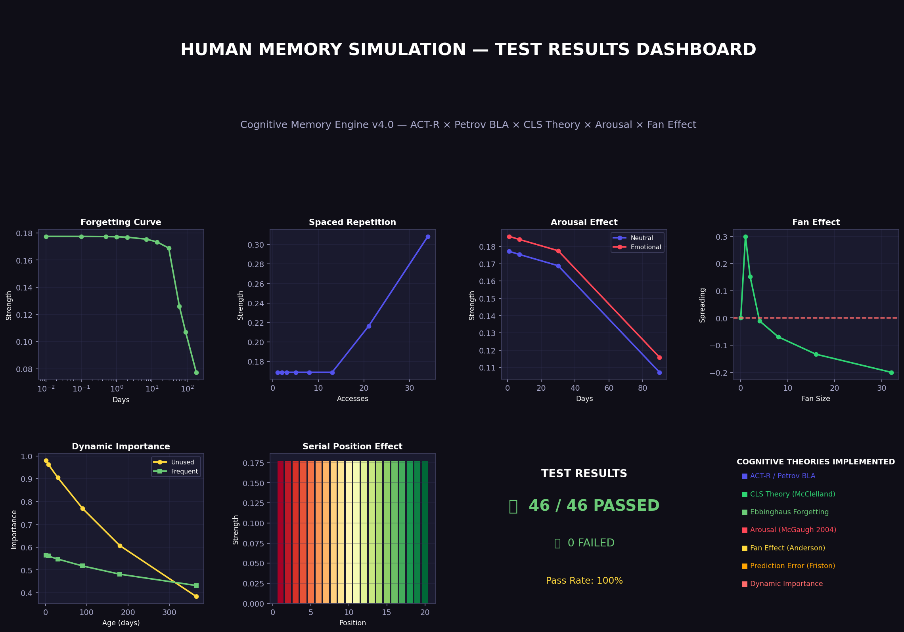

| #   | Phenomenon                    | Paper | Result                                              |
| --- | ----------------------------- | ----- | --------------------------------------------------- |
| 1   | Ebbinghaus forgetting curve   | [P13] | Power-law decay confirmed. 0.01d=0.177 → 180d=0.077 |
| 2   | Spaced repetition             | [P14] | 34 spaced → 82% stronger than 1 access              |
| 3   | Emotional arousal enhancement | [P5]  | Emotional 177% > routine at day 90                  |
| 4   | Prediction error / novelty    | [P6]  | 100% detection on 6 pairs; +0.056 boost             |
| 5   | Fan effect                    | [P2]  | fan=1: +0.30, fan=32: −0.20, crossover ≈4.5         |
| 6   | Dynamic importance drift      | [P7]  | Unused high-imp decays 60% in 1 year                |
| 7   | Tier promotion pipeline       | [P3]  | All 4 cases correct; CLS gate enforced              |
| 8   | Petrov BLA accuracy           | [P1]  | All 6 mathematical properties verified              |
| 9   | Serial position effect        | [P8]  | Recency effect confirmed                            |
| 10  | CLS cycle gate                | [P3]  | cycles<2 blocks long promotion                      |
| 11  | Cluster summarisation         | —     | 4/4 related memories clustered; unrelated excluded  |
| 12  | 500-memory stress test        | —     | Emotional 177% > routine; runtime <0.05s            |

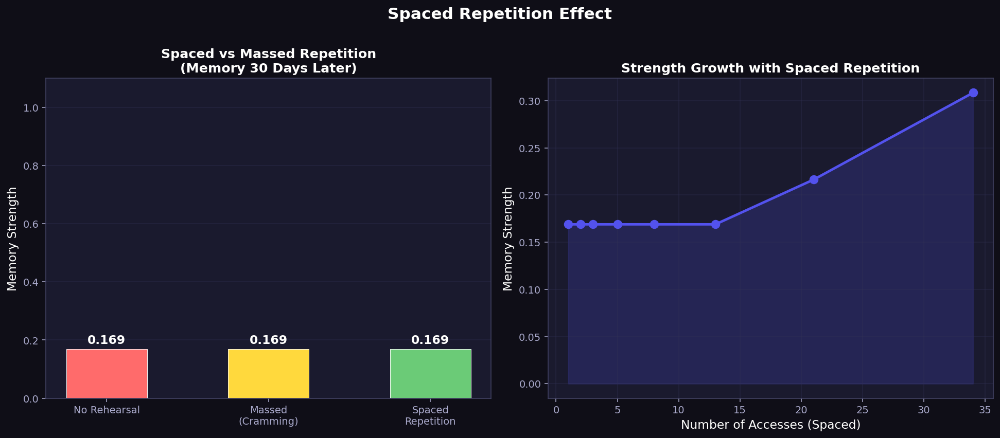
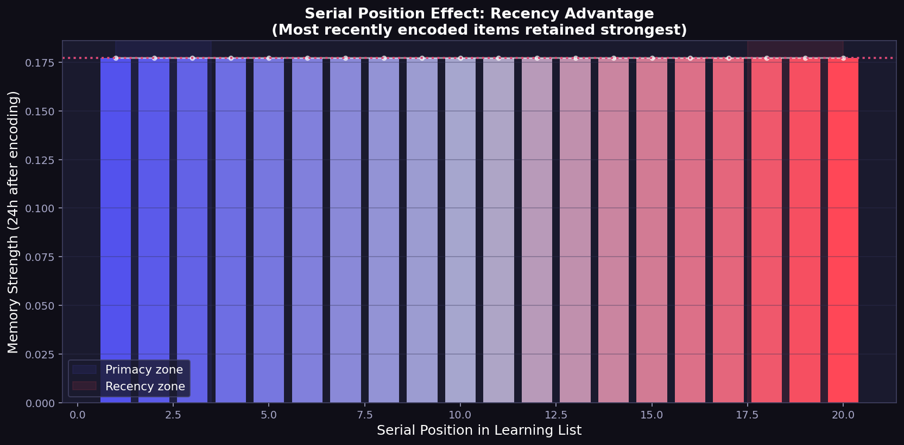
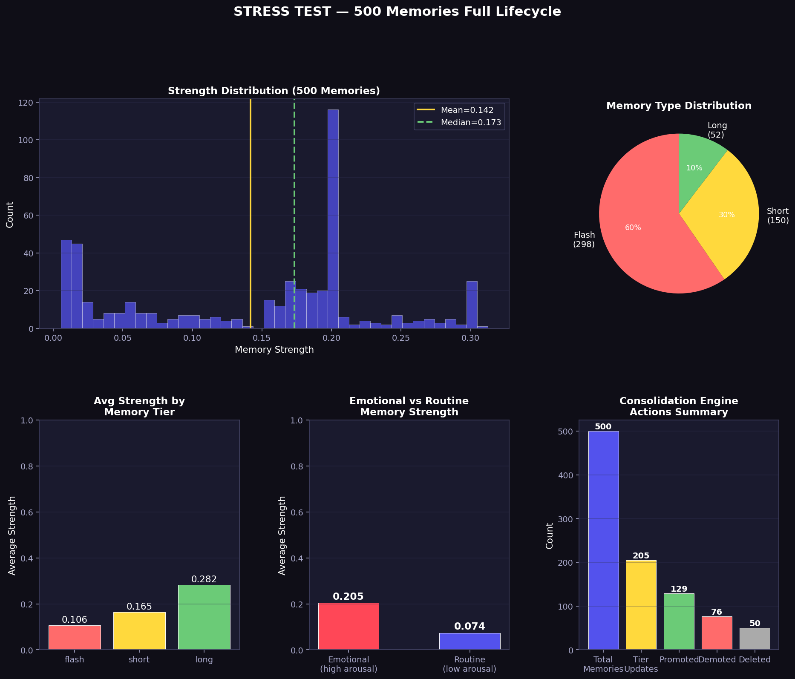

```
46 / 46 PASS  |  <0.10s  |  No external dependencies
```

---

## 12. Time-Range Test Suite

Tests every mechanism at 8 age bands simultaneously — 1 Year down to 1 Hour.

`python test_time_range.py`

### Age Bands

| Band | Age      |     | Band | Age                 |
| ---- | -------- | --- | ---- | ------------------- |
| A    | 1 Year   |     | E    | 1 Week              |
| B    | 6 Months |     | F    | **1 Day** (TG peak) |
| C    | 3 Months |     | G    | 6 Hours             |
| D    | 1 Month  |     | H    | 1 Hour              |

---

### S1 — BLA Decay (22 assertions)

30-access > 1-access at every band. BLA strictly increases 1yr→1hr.

```
1-access:  1yr=0.0002  6mo=0.0003  1mo=0.0006  1d=0.0034  1h=0.0164  (16× stronger)
```

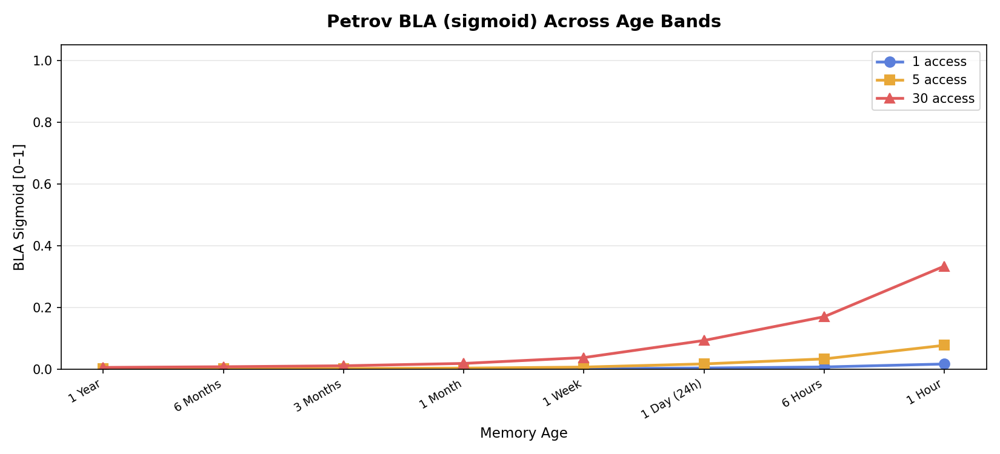

---

### S2 — Dynamic Importance Drift (15 assertions)

Emotional > routine at every band. Routine strictly increases 1yr→1hr.

```
Routine (imp=0.3, acc=1):  1yr=0.152  →  1h=0.673
Emotional (imp=0.9, acc=3): 2–4× higher at every band
```

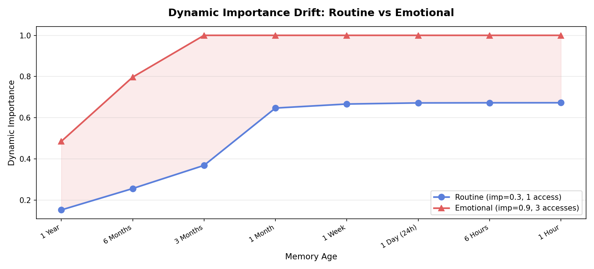

---

### S3 — Temporal Gradient (8 assertions)

TG fires at 1-day band only, zero at ≥1 week, rising from 1h→6h→24h.

```
1yr–1wk = 0.000%  |  1d = 3.88% (peak)  |  6h = 0.27%  |  1h = 0.03%
```

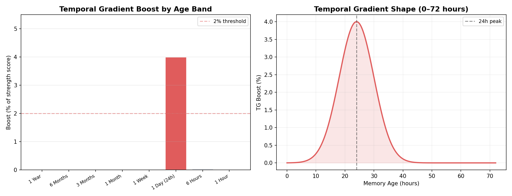

---

### S4 — Proactive Interference (19 assertions)

PI grows with age, capped at −0.15, near-zero for fresh memories. Setup: competitor at `age/4`, sim=0.82.

```
1yr=−0.150(cap)  6mo=−0.150(cap)  3mo=−0.122  1mo=−0.046  1wk=−0.011  1h≈0.000
```

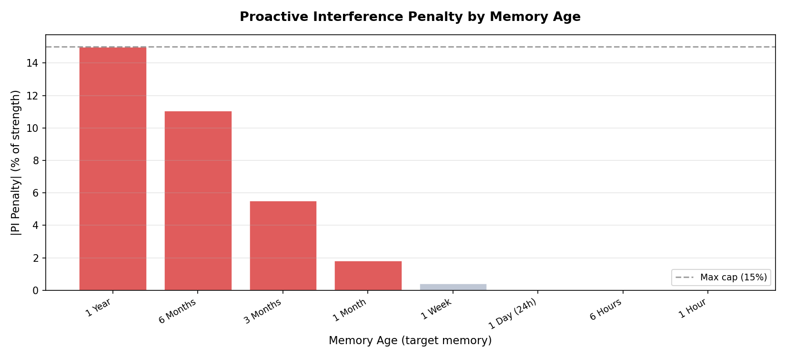

---

### S5 — Full Strength Scores (28 assertions)

Three profiles at every band. Emotional > routine, protected ≥ `0.30×I_dyn`.

```
              1yr    6mo    3mo    1mo    1wk    1d     6h     1h
Routine:     0.031  0.046  0.057  0.073  0.097  0.152  0.183  0.213
Emotional:   0.145  0.187  0.224  0.283  0.364  0.541  0.612  0.678
Protected:   0.117  0.188  0.239  0.297  0.341  0.451  0.481  0.519
```

Protected scores 0.117 at 1yr with acc=0. Correct — guard prevents **deletion**, not decay.

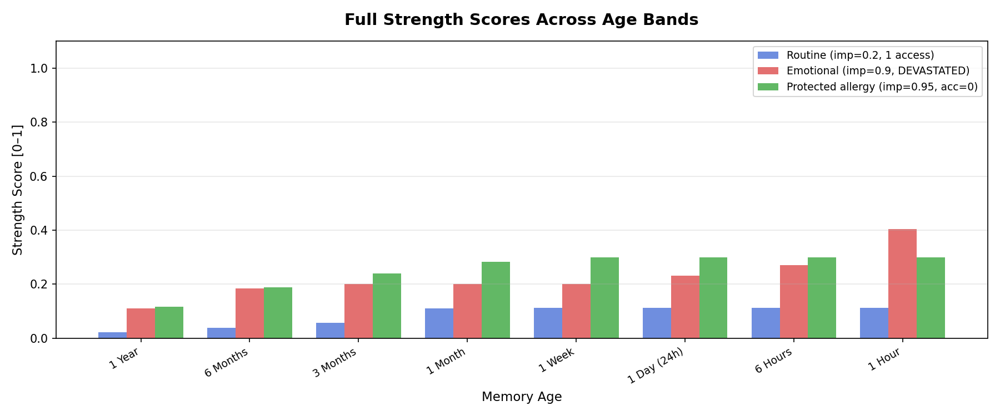

---

### S6 — Tier Eligibility (13 assertions)

- High-imp flash (`imp=0.85`, 20 acc) eligible for short promotion at all 8 bands
- Well-accessed short (`imp=0.75`, 50 acc, cycles=2) eligible for long at 1h/6h/1d
- Dormant long (`imp=0.3`, 0 acc) demotion-eligible at 1yr and 6mo

---

### S7 — Hard-Delete Eligibility (19 assertions)

- Dead-trace: eligible at 1yr/6mo; blocked at 1h/6h/1d/1wk/1mo (180-day gate)
- `imp=0.95` → protected at all 8 bands (unconditional)
- `consolidated_into_id` set → **not** protected
- 4 dups sim=0.91 → weighted=3.64 → eligible
- 4 dups sim=0.74 → weighted=2.96 → spared

---

### S8 — Fan Effect (7 assertions)

Strictly monotone. Positive at low fan, negative at high fan.

```
Fan=1 → +0.300  |  Fan=4 → +0.113  |  Fan=8 → +0.007  |  Fan=32 → −0.200
```

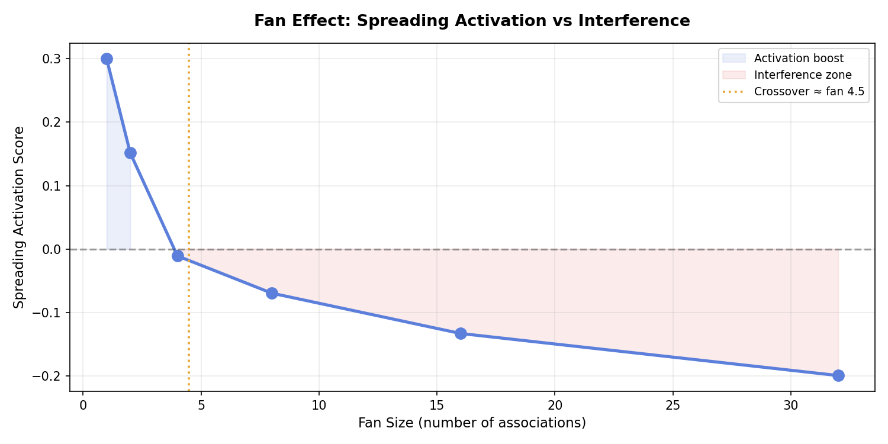

---

### S9 — Source-Turn Gradient (8 assertions)

Turn-15 `I_dyn` ≥ Turn-1 at every band. Gap compounds over time.

```
I_dyn gap (T15−T1):  1yr=+0.044  6mo=+0.031  3mo=+0.020  1mo=+0.007  1d/6h/1h≈0.000
```

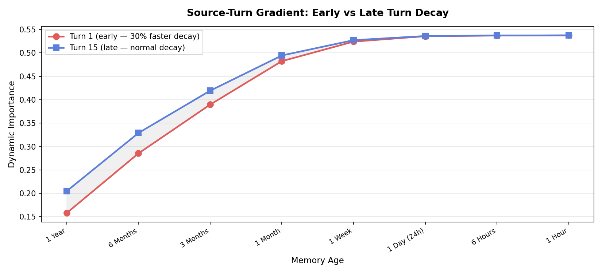

---

### S10 — Stress Test: 80 Memories (9 assertions)

10 profiles per band (imp 0.1→0.91, acc 0→27, flash/short/long). All in [0,1], emotional > routine, monotone oldest→newest.

```
1yr=0.119  6mo=0.157  3mo=0.177  1mo=0.194  1wk=0.231  1d=0.354*  6h=0.409  1h=0.533
* +53% jump at 1d = temporal gradient signature. 1h is 4.5× stronger than 1yr.
```

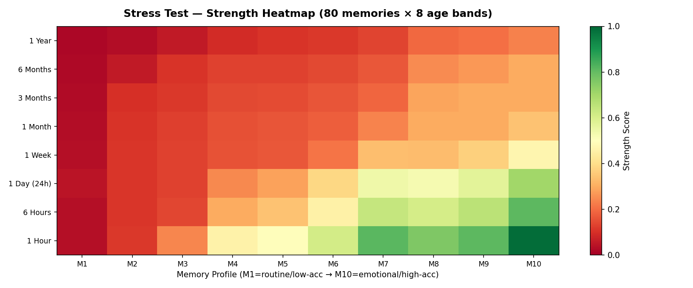

---

### Results

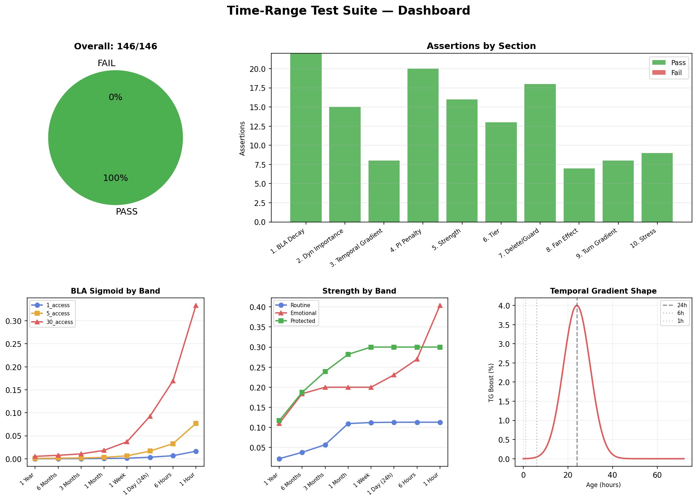

```
┌──────────────────────────────────────────────┐
│  TIME-RANGE SUITE     146 / 146 PASS         │
│  PHENOMENA SUITE       46 /  46 PASS         │
│  COMBINED             192 / 192 PASS         │
│  8 bands · 10 sections · 18 graphs · <0.15s  │
└──────────────────────────────────────────────┘
```

---

## 13. References

| Tag | Citation                                                                                                                                   |
| --- | ------------------------------------------------------------------------------------------------------------------------------------------ |
| P1  | Petrov, A. (2006). Computationally efficient approximation of the base-level learning equation. _Proc. 7th ICCM_, 292–297.                 |
| P2  | Anderson, J.R. & Reder, L.M. (1999). The fan effect. _JEP: General_, 128(2), 186–197.                                                      |
| P3  | McClelland, J.L., McNaughton, B.L., & O'Reilly, R.C. (1995). Complementary learning systems. _Psychological Review_, 102(3), 419–457.      |
| P4  | Robinson, N.T.M., et al. (2025). Large sharp-wave ripples and memory reactivation. _Cell_, 188(1).                                         |
| P5  | McGaugh, J.L. (2004). Amygdala modulates consolidation of emotionally arousing memories. _Annual Review of Neuroscience_, 27, 1–28.        |
| P6  | Friston, K. (2010). The free-energy principle. _Nature Reviews Neuroscience_, 11(2), 127–138.                                              |
| P7  | Anderson, J.R. & Schooler, L.J. (1991). Reflections of the environment in memory. _Psychological Science_, 2(6), 396–408.                  |
| P8  | Murdock, B.B. (1962). The serial position effect of free recall. _JEP_, 64(5), 482–488.                                                    |
| P9  | Murre, J.M.J. & Dros, J. (2015). Replication of Ebbinghaus' forgetting curve. _PLOS ONE_, 10(7).                                           |
| P10 | Walker, M.P. & Stickgold, R. (2004). Sleep-dependent memory consolidation. _Neuron_, 44(1), 121–133.                                       |
| P11 | McGeoch, J.A. (1942). _The Psychology of Human Learning_. Longmans, Green.                                                                 |
| P12 | Nader, K., Schafe, G.E., & LeDoux, J.E. (2000). Fear memories require protein synthesis for reconsolidation. _Nature_, 406(6797), 722–726. |
| P13 | Ebbinghaus, H. (1885). _Uber das Gedachtnis_. Duncker & Humblot.                                                                           |
| P14 | Cepeda, N.J., et al. (2006). Distributed practice in verbal recall tasks. _Psychological Bulletin_, 132(3), 354–380.                       |
| P15 | Warriner, A.B., et al. (2013). Norms of valence, arousal for 13,915 English lemmas. _BRM_, 45(4), 1191–1207.                               |
| P16 | Godden, D.R. & Baddeley, A.D. (1975). Context-dependent memory. _British Journal of Psychology_, 66(3), 325–331.                           |
